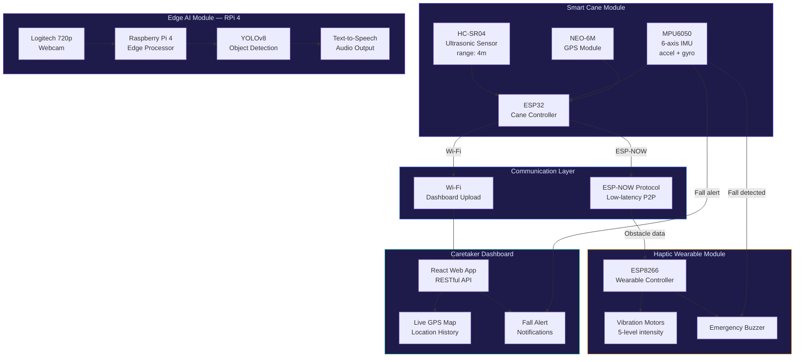

<div align="center">

# DristiGuide — Smart Assistive Navigation System

**Synchronized IoT ecosystem for real-time obstacle avoidance, fall detection, and GPS tracking — deployed as a smart-cane and haptic wearable module for the visually impaired**

[](https://opensource.org/licenses/MIT)


</div>

---

## The Problem

Over 285 million people worldwide are visually impaired, and navigating unfamiliar environments independently remains a daily challenge. Existing commercial aids (white canes, basic ultrasonic detectors) provide limited range and zero contextual awareness. There's no affordable, integrated system that combines obstacle detection, fall safety monitoring, AI-powered scene understanding, and real-time caretaker alerts into a single wearable ecosystem.

DristiGuide is a multi-node IoT assistive system that operates as a synchronized smart-cane and haptic wearable. It fuses ultrasonic ranging, inertial sensing, GPS tracking, and YOLOv8-based scene perception into a low-latency, battery-powered package — providing spatial awareness to users who can't rely on vision.

---

## What This Does

A distributed embedded system spanning ESP32, ESP8266, and Raspberry Pi 4 nodes — communicating over ESP-NOW — that provides:

- **4-meter obstacle detection** via HC-SR04 ultrasonic sensors with 5-level haptic feedback proportional to proximity
- **Fall detection** using MPU6050 accelerometer/gyroscope with configurable threshold algorithms and emergency buzzer alerts
- **Real-time GPS tracking** via NEO-6M module with web-based caretaker monitoring dashboard
- **AI scene perception** — YOLOv8 object detection on Raspberry Pi 4 processing a live webcam feed, providing audio descriptions of the environment
- **ESP-NOW mesh communication** — sub-millisecond latency between sensor nodes and actuator nodes without Wi-Fi infrastructure

---

## System Architecture



---

## Tech Stack

### Hardware

| Component | Model | Role |
|:---|:---|:---|
| **Microcontroller** | ESP32 | Smart cane controller, sensor aggregation, ESP-NOW TX |
| **Microcontroller** | ESP8266 | Wearable controller, haptic feedback, ESP-NOW RX |
| **Edge Computer** | Raspberry Pi 4 | YOLOv8 inference, TTS, dashboard server |
| **Ultrasonic Sensor** | HC-SR04 | Obstacle detection (2cm – 4m range) |
| **IMU** | MPU6050 | 6-axis accelerometer/gyroscope for fall detection |
| **GPS** | NEO-6M | Real-time geolocation tracking |
| **Camera** | Logitech 720p | Scene perception video feed |
| **Actuators** | Vibration motors, Piezo buzzer | Haptic feedback, emergency alerts |

### Software

| Technology | Role |
|:---|:---|
| **C++ / Arduino** | Embedded firmware for ESP32 and ESP8266 |
| **Python** | YOLOv8 inference pipeline, TTS integration |
| **OpenCV** | Video capture and frame processing |
| **Ultralytics YOLOv8** | Real-time object detection |
| **React / JavaScript** | Web dashboard for caretaker monitoring |
| **ESP-NOW** | Low-latency peer-to-peer wireless protocol |
| **Raspberry Pi OS** | Linux-based edge compute platform |

---

## Core Features

| Feature | Implementation |
|:---|:---|
| **Obstacle Detection** | HC-SR04 ultrasonic ranging → distance buckets → 5-level vibration intensity mapping |
| **Haptic Feedback** | PWM-driven vibration motors with proportional distance encoding (closer = stronger) |
| **Fall Detection** | MPU6050 magnitude threshold + free-fall detection algorithm → buzzer + web alert |
| **GPS Tracking** | NEO-6M NMEA parsing → coordinates sent over Wi-Fi → real-time map pin on dashboard |
| **AI Scene Perception** | Live webcam → YOLOv8 inference → detected objects → Google TTS audio description |
| **Emergency Alerts** | Fall event + GPS coordinates → push notification to caretaker dashboard |
| **Wireless Mesh** | ESP-NOW for sensor-to-actuator communication without Wi-Fi infrastructure dependency |
| **Power Management** | Deep sleep modes on ESP nodes, efficient duty cycling for battery longevity |

---

## Getting Started

### Prerequisites
- Arduino IDE 2.x with ESP32/ESP8266 board packages
- Python 3.8+ (for Raspberry Pi)
- Raspberry Pi 4 with Raspberry Pi OS
- Hardware components listed above

### Firmware Upload

```bash
# Clone the repository
git clone https://github.com/Hazz-Y/DristiGuide-Navigation-Assistant.git
cd DristiGuide-Navigation-Assistant

# Flash ESP32 (Smart Cane)
# Open firmware/smart_cane/smart_cane.ino in Arduino IDE
# Select Board: ESP32 Dev Module → Upload

# Flash ESP8266 (Wearable)
# Open firmware/wearable/wearable.ino in Arduino IDE
# Select Board: NodeMCU 1.0 → Upload
```

### Edge AI Setup (Raspberry Pi)

```bash
cd edge_ai
pip install -r requirements.txt

# Start YOLOv8 scene perception
python scene_detector.py

# Start web dashboard
cd ../dashboard
npm install && npm run dev
```

---

## Project Structure

```
DristiGuide-Navigation-Assistant/
├── firmware/
│   ├── smart_cane/              # ESP32 firmware — sensors, ESP-NOW TX
│   └── wearable/                # ESP8266 firmware — haptics, ESP-NOW RX
├── edge_ai/
│   ├── scene_detector.py        # YOLOv8 inference + TTS pipeline
│   ├── fall_detector.py         # MPU6050 fall detection algorithm
│   └── requirements.txt
├── dashboard/
│   ├── src/                     # React web dashboard
│   └── api/                     # RESTful endpoints for GPS + alerts
├── assets/
│   └── images/                  # Hardware photos, tech stack icons
├── docs/
│   └── circuit_diagrams/        # Wiring schematics
└── README.md
```

---

## License

MIT — see [LICENSE](LICENSE) for details.
