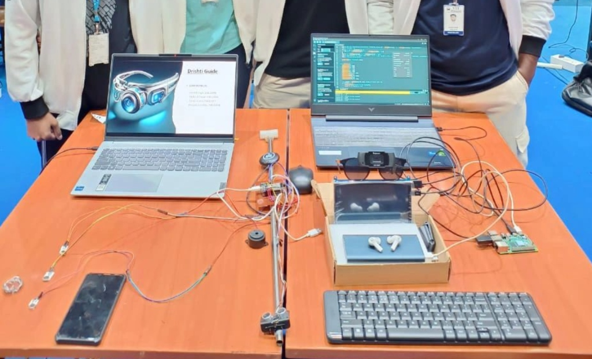
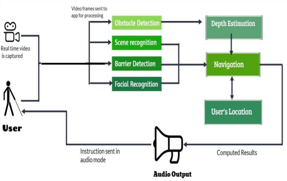
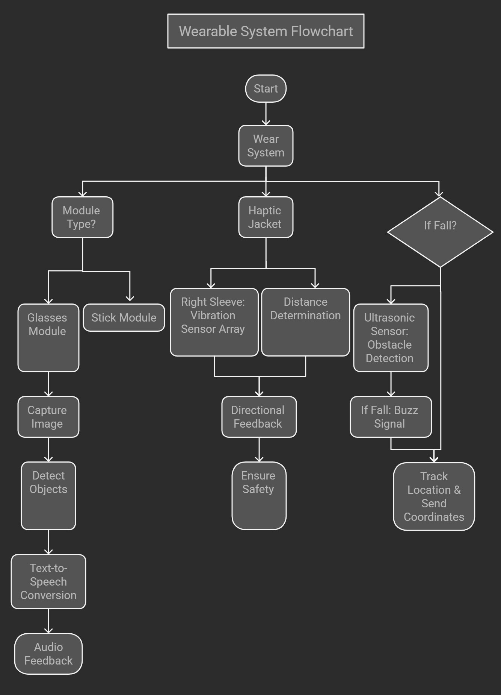
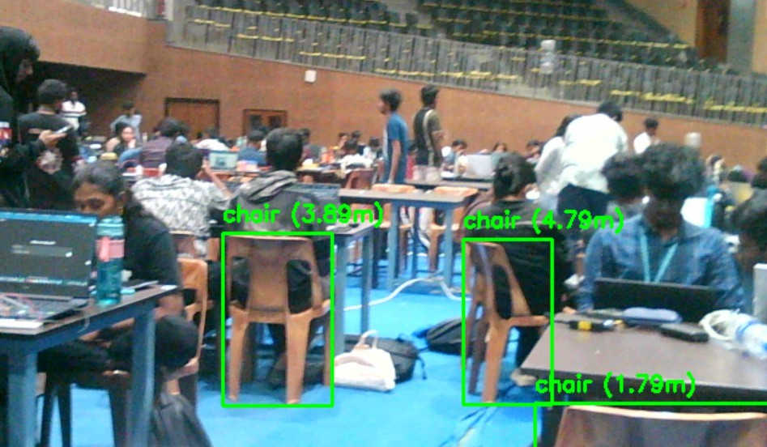
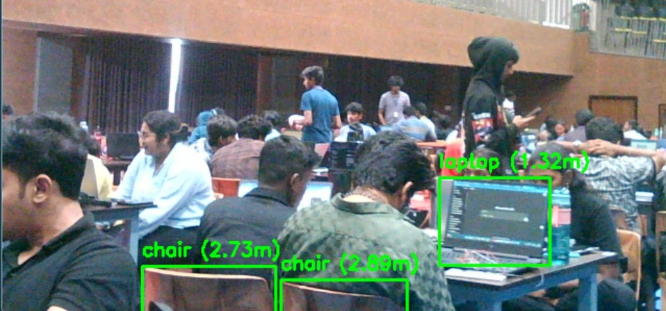
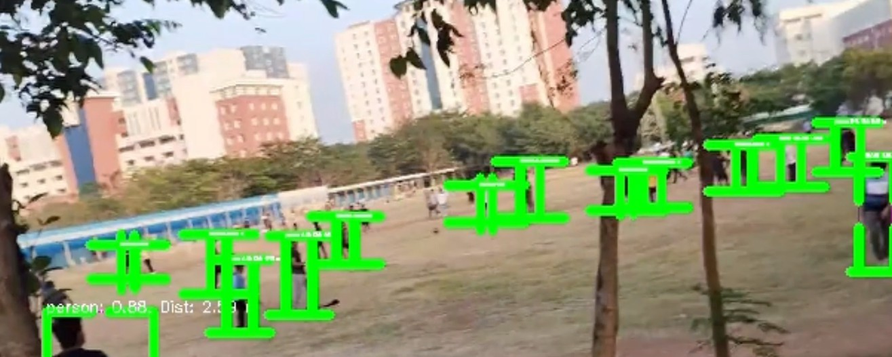
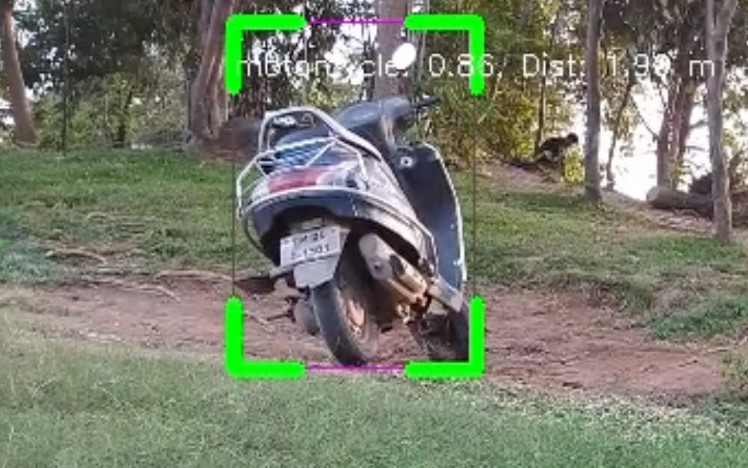
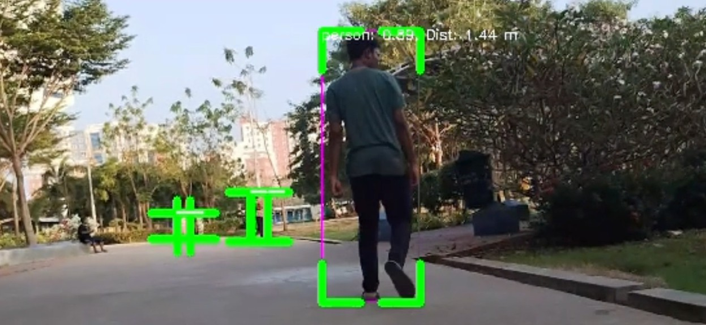
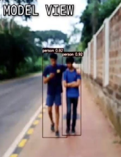

<div align="center">

# 👁️ DristiGuide — Smart Assistive Navigation System

### *IoT-Enabled Wearable & Computer Vision Solution for the Visually Impaired*

<br>



<br><br>

[](https://www.arduino.cc/)
[](https://python.org)
[](https://espressif.com)
[](https://raspberrypi.org)
[](https://opencv.org)
[](https://ultralytics.com)
[](LICENSE)

<br>

**DristiGuide is an integrated IoT and Edge-AI assistive ecosystem designed to provide real-time spatial awareness, obstacle avoidance, fall detection, and emergency tracking. Combining a distributed multi-node micro-controller network (ESP32/ESP8266) with a local Raspberry Pi 4 Computer Vision gateway running YOLOv8, it provides haptic, acoustic, and vocal environment feedback for high-independence mobility.**

[🚀 Quick Start](#-quick-start) · [🏗️ System Architecture](#%EF%B8%8F-system-architecture) · [📊 Specs](#-technical-specifications) · [🔬 AI Testing](#-ai-vision-testing--field-validation) · [🗺️ Roadmap](#%EF%B8%8F-roadmap)

</div>

---

## 📌 Table of Contents

- [Highlights](#-highlights)
- [Why DristiGuide?](#-why-dristiguide)
- [Key Features](#-key-features)
- [System Architecture](#%EF%B8%8F-system-architecture)
- [Technical Specifications](#-technical-specifications)
- [Hardware Components](#-hardware-components)
- [AI Vision Testing & Field Validation](#-ai-vision-testing--field-validation)
- [Project Directory Structure](#-project-directory-structure)
- [Quick Start](#-quick-start)
- [Roadmap](#%EF%B8%8F-roadmap)
- [License](#-license)
- [Contact & Support](#-author)

---

## ✨ Highlights

<table>
<tr>
<td width="55%">

🔊 **AI Scene Perception** — Instantly identifies objects (people, vehicles, chairs, stairs) in the path and reads them aloud.

🛡️ **Fall & Tilt Guardian** — Detects sudden tumbles or cane-drops using inertial sensors, auto-triggering local audio alarms.

📡 **Ultra-Low Latency** — Harnesses the offline ESP-NOW protocol to communicate between wearables and cane in under 50ms.

🧭 **Emergency Localization** — Pins exact coordinate positions via NEO-6M GPS on a secure local WiFi dashboard web server.

📟 **Dynamic Haptic Feedback** — Modulates vibration intensity through 5 custom haptic levels as obstacles approach.

</td>
<td width="45%">



</td>
</tr>
</table>

---

## 💡 Why DristiGuide?

In outdoor and complex indoor spaces, traditional navigation tools fall short of providing real safety:

| ❌ Conventional Tools | ✅ DristiGuide Advanced Solution |
|---|---|
| White canes fail to detect elevated objects or head-level hazards | High-frequency ultrasonic ranging scans the vertical path from chest to head |
| Wearables with complex wiring limit range and cause fatigue | Fully wireless, battery-optimized ESP-NOW sensor and receiver node topology |
| Basic proximity sensors cannot classify objects or potential threats | Edge-AI YOLOv8 object detection model on RPi 4 identifies specific targets |
| Safety alarms fail when mobile internet signals drop | 100% offline local communication server and peer-to-peer mesh networks |
| Relatives cannot track visually impaired users in emergencies | Integrated NEO-6M GPS uploads coordinates to a local web server interface |

---

## 🚀 Key Features

<table>
<tr>
<td align="center" width="33%">
<h3>👁️ AI Object Detection</h3>
<p>Inference on edge camera feeds to detect obstacles and convert them into spoken prompts</p>
</td>
<td align="center" width="33%">
<h3>📳 Spatial Haptic Pulse</h3>
<p>5 discrete distance categories translated to motor vibration frequencies</p>
</td>
<td align="center" width="33%">
<h3>🩼 Inertial Fall Detection</h3>
<p>MPU6050 6-axis gyro algorithm detects sudden falls, sounding sirens automatically</p>
</td>
</tr>
<tr>
<td align="center" width="33%">
<h3>🛰️ NEO-6M GPS Tracking</h3>
<p>Acquires coordinate positioning for user localization and emergency sharing</p>
</td>
<td align="center" width="33%">
<h3>📶 Low-Latency ESP-NOW</h3>
<p>Custom wireless communication layer bypassing WiFi congestion</p>
</td>
<td align="center" width="33%">
<h3>🕸️ Web Server Dashboard</h3>
<p>Local dashboard map displaying telemetry coordinates for guardians</p>
</td>
</tr>
</table>

---

## 🏗️ System Architecture

DristiGuide utilizes a distributed four-tier computing model to run sensor aggregation, wireless telemetry, web serving, and computer vision model inference:

<br>



<br><br>

```
                  ┌─────────────────────────────────────────┐
                  │        Raspberry Pi 4 Vision Gateway    │ (Webcam Input)
                  │   [OpenCV + YOLOv8 Edge AI Classifier]  │
                  └────────────────────┬────────────────────┘
                                       │ (USB Serial)
                                       ▼
┌─────────────────────────┐   ESP-NOW  ┌─────────────────────────┐
│  Smart-Cane Node (TX)   ├───────────►│   Wearable Haptic Node  │
│  [ESP8266 + HC-SR04]    │  (<50ms)   │  [ESP8266 + Haptic Grid]│
└─────────────────────────┘            └─────────────────────────┘
                                                    ▲
                                                    │ ESP-NOW
                                                    ▼
                                       ┌─────────────────────────┐
                                       │  Edge Orchestrator (RX) │
                                       │   [ESP32 Server + GPS]  │
                                       └─────────────────────────┘
```

1. **Smart-Cane Node (Transmitter):** Powered by an ESP8266 NodeMCU. Continually reads HC-SR04 ultrasonic sensors to determine obstacle proximity and broadcasts ranging packets.
2. **Wearable Haptic Node (Receiver):** Decodes raw distance packets and translates them into haptic vibration intensity levels.
3. **Edge Orchestrator (Main Controller):** An ESP32 DevKit V1 that acts as the central hub. It aggregates telemetry, processes 6-axis inertial motion vector data (MPU6050) to evaluate fall alerts, and parses NEO-6M strings to serve emergency maps over a local AP.
4. **Raspberry Pi 4 Vision Gateway:** Interfaces with a USB Logitech camera. It processes frames offline using Python, OpenCV, and PyTorch-based Ultralytics YOLOv8, reporting categorized hazard names out loud.

---

## 📊 Technical Specifications

### System Performance
| Performance Metric | Specification |
| :--- | :--- |
| **Ultrasonic Ranging Range** | 2 cm – 400 cm |
| **Wireless Transmit Latency** | < 45 ms (ESP-NOW) |
| **Communication Protocol** | ESP-NOW Peer-to-Peer Mesh (2.4 GHz) |
| **Local WiFi AP Network IP** | `192.168.4.1` (BlindStick_AP) |
| **GPS Position Accuracy** | ±3 meters (Outdoor sky line-of-sight) |
| **Power Management** | Deep sleep integration for passive nodes |

### Hardware Mapping
| Component | Device Model | Microcontroller Interface | Pins / Description |
| :--- | :--- | :--- | :--- |
| **Microcontrollers** | ESP32-WROOM-32D, NodeMCU ESP8266 | Dual-Core Tensilica & Tensilica L106 | 2.4 GHz Radio + GPIO Matrix |
| **Ultrasonic Sensor** | HC-SR04 | ESP8266 GPIO Node | Trig: `D1` (GPIO5), Echo: `D2` (GPIO4) |
| **Inertial Measurement**| MPU-6050 | ESP32 Orchestrator | I2C (SDA: `GPIO21`, SCL: `GPIO22`) |
| **GPS Module** | NEO-6M | ESP32 Orchestrator | Hardware Serial (RX: `GPIO16`, TX: `GPIO17`) |
| **Haptic Feedback** | 5V Vibration Motors | ESP8266 Receiver Node | Analog / PWM Driven Core |
| **Edge Processor** | Raspberry Pi 4 Model B (4GB) | USB Host Controller | runs YOLOv8 Offline Inference |

---

## 🔬 AI Vision Testing & Field Validation

The advanced visual pipeline uses a lightweight **YOLOv8 nano** model running offline on the RPi 4. It correctly identifies pedestrian hazards, structural components, and daily assets in under **150ms** per frame.

<p align="center">
  
  
  
  
</p>
<p align="center">
  
  
  
</p>

---

## 📁 Project Directory Structure

```
DristiGuide-Navigation-Assistant/
│
├── src/
│   ├── esp32-main-controller/    # Master node firmware (GPS, IMU, local Web Server)
│   │   ├── esp32-main-controller.ino
│   │   ├── config.h              # Pin definitions & network credentials
│   │   ├── sensors.h             # IMU MPU6050 parsing logic
│   │   ├── fall_detection.h      # Acceleration math & alert thresholds
│   │   ├── wifi_manager.h        # Web portal config
│   │   └── buzzer_control.h      # Siren sequencing
│   │
│   ├── esp8266-nodes/
│   │   ├── transmitter/          # Smart-Cane ultrasonic sensor firmware
│   │   │   ├── transmitter.ino
│   │   │   └── config.h
│   │   └── receiver/             # Wearable haptic motor controller firmware
│   │       ├── receiver.ino
│   │       └── config.h
│   │
│   └── web-interface/            # Frontend telemetry UI dashboard
│       ├── index.html
│       ├── style.css
│       └── script.js
│
├── hardware/                     # CAD designs & Schematics 
│   ├── schematics/               # Circuit schematics
│   └── bill_of_materials/        # Hardware catalog & component costs
│
├── docs/                         # Manuals & Technical docs
├── tests/                        # Sensor unit tests & communications suites
└── requirements.txt              # Host package dependencies
```

---

## 🚀 Quick Start

### 1. Prerequisite Installations
Ensure you have the latest **Arduino IDE** (with ESP32 and ESP8266 board manager URLs added) or **PlatformIO** installed. On the Raspberry Pi, set up Python 3.9+ with PyTorch:
```bash
pip install -r requirements.txt
```

### 2. Configure Node MAC Addresses
To enable ESP-NOW peer communication, read the MAC address of the ESP8266 Wearable Haptic Node and configure it in the Transmitter configuration file:
* Open [src/esp8266-nodes/transmitter/config.h](file:///d:/Projects/Github_Projects/DristiGuide-Navigation-Assistant/src/esp8266-nodes/transmitter/config.h)
* Replace the `broadcastAddress` array with the target receiver node's MAC address:
```cpp
uint8_t broadcastAddress[] = {0xAA, 0xBB, 0xCC, 0xDD, 0xEE, 0xFF};
```

### 3. Flash Microcontroller Nodes
Select the corresponding board and port in your environment to compile and flash the nodes:

```bash
# Compile and flash Cane Node (ESP8266)
arduino-cli compile --fqbn esp8266:esp8266:nodemcuv2 src/esp8266-nodes/transmitter/
arduino-cli upload -p /dev/ttyUSB0 --fqbn esp8266:esp8266:nodemcuv2 src/esp8266-nodes/transmitter/

# Compile and flash Wearable Node (ESP8266)
arduino-cli compile --fqbn esp8266:esp8266:nodemcuv2 src/esp8266-nodes/receiver/
arduino-cli upload -p /dev/ttyUSB1 --fqbn esp8266:esp8266:nodemcuv2 src/esp8266-nodes/receiver/

# Compile and flash Main Controller Node (ESP32)
arduino-cli compile --fqbn esp32:esp32:devkitv1 src/esp32-main-controller/
arduino-cli upload -p /dev/ttyUSB2 --fqbn esp32:esp32:devkitv1 src/esp32-main-controller/
```

### 4. Running the Dashboard Map
Connect your smartphone or computer to the wireless access point **"BlindStick_AP"** spawned by the ESP32 Orchestrator, then open your browser and navigate to:
```
http://192.168.4.1/gps
```
This local interface displays immediate GPS coords, satellite connections, active coordinates, and fall alert history.

---

## 🗺️ Roadmap

- [x] Implement multi-node ESP-NOW mesh network.
- [x] Configure custom MPU6050 fall detection formulas.
- [x] Port YOLOv8 visual classifier models onto the edge Pi 4 gateway.
- [ ] Integrate local audio text-to-speech feedback via bone-conduction headsets.
- [ ] Upgrade GPS tracking interface to run offline Mapbox map caches.

---

## 📜 License

This project is licensed under the MIT License - see the [LICENSE](LICENSE) file for details.

---

## 👨‍💻 Author

**Harsh Yadav** — *Embedded Systems & IoT Engineer*  
* 🐙 [GitHub Profile](https://github.com/Hazz-Y)  
* 📧 [harsh01yadav08@gmail.com](mailto:harsh01yadav08@gmail.com)  

---
*Built with passion for accessible technology and assistive IoT innovation.*